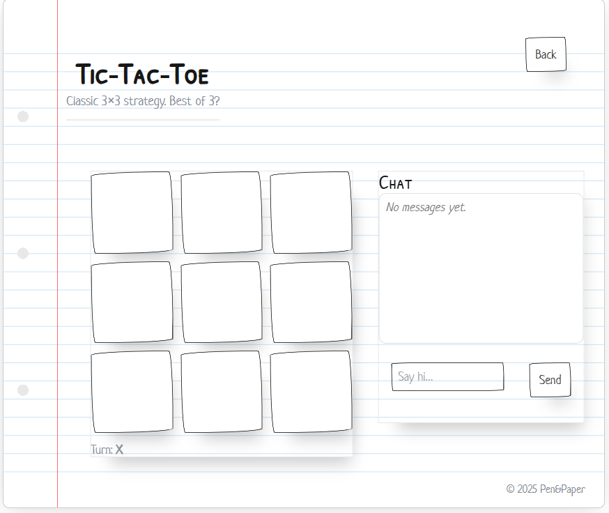

# Supabase-Nextjs-Pen-and-Paper-Games

> Play classic pen & paper games online with friends or against AI  

## What is Pen&Paper?

Pen&Paper is a modern reimagining of nostalgic pen-and-paper games like **Tic-Tac-Toe** and **Hangman**.  
Built with **Next.js** and **Supabase**, it lets you invite friends, play locally against simple AI, and chat in real-time — all wrapped in a playful notebook-style UI.  

## Key Features

- **Online Multiplayer**: Invite a friend with a shareable game link  
- **Local Play with AI**: Challenge the computer when no friends are around  
- **Realtime Chat**: In-game messaging powered by Supabase Realtime  
- **Anonymous Login**: No sign-up required — just start playing  
- **Notebook UI**: A playful paper-inspired interface built with PaperCSS  
- **Cross-Platform**: Works smoothly on desktop and mobile  

## Live Application

**[Try Pen&Paper Live →](https://pen-and-paper-puce.vercel.app/)**

*Challenge a friend or play against AI — right in your browser!*

## How It Works

1. **Choose a Game**: Select Tic-Tac-Toe or Hangman from the home screen  
2. **Invite or Join**: Start a new game and share your link, or join an existing match  
3. **Play**: Make moves in real-time with chat alongside gameplay  
4. **Solo Mode**: Try local mode against the AI for quick practice  

## Technology Stack

### Frontend
- **Next.js (App Router)** - Modern React framework  
- **React + TypeScript** - Type-safe UI development  
- **PaperCSS + CSS Modules** - Notebook-inspired design and scoped styling  

### Backend & Services
- **Supabase Authentication** - Anonymous login support  
- **Supabase Realtime** - Live updates for chat and moves  
- **Supabase Postgres** - Match and game state persistence  
- **Vercel** - Fast, serverless hosting and deployment  

## Supported Games

- **Tic-Tac-Toe** (online + local vs AI)  
- **Hangman** (local play)  
- *(Coming soon: Connect Four, Battleships)*  

## Project Status

**Work in Progress** — actively expanding features and game modes.  

### Current Features
- Online Tic-Tac-Toe with invites  
- Local Tic-Tac-Toe with AI opponent  
- Local Hangman  
- Realtime chat during matches  
- Notebook-themed UI  

### Upcoming Features
- Connect Four (local + online)  
- Battleships  
- Smarter AI opponents  
- Player profiles and statistics  

## Screenshots

| Stage           | Screenshot                                      |
|-----------------|------------------------------------------------|
| **Home Page**   |  |
| **Game Options**|  |
| **Gameplay**    |  |

## Privacy & Security

- All game data is stored securely in Supabase  
- Anonymous authentication ensures frictionless access  
- No personal data is required to play  

## Feedback & Support

This is an evolving project! Found a bug or have a feature request? I'd love to hear from you!  

- **Report Issues**: Create an issue in this GitHub repository  
- **Feature Requests**: Open a discussion or issue on GitHub  
- **General Questions**: Use the GitHub Issues section for questions  

## Learning Outcomes

This project demonstrates proficiency in:  

- **Modern React + Next.js Development**  
- **Supabase Integration** for Auth, Realtime, and Database  
- **Realtime Applications** with live chat and move sync  
- **Authentication Systems** (anonymous sessions)  
- **Responsive Design** with PaperCSS and CSS Modules  
- **Cloud Deployment** with Vercel  

## Development & Deployment

- **Development**: Next.js local development server  
- **CI/CD**: Automatic deployments via Vercel connected to GitHub  
- **Scalability**: Built on Supabase’s and Vercel’s auto-scaling infrastructure  

---

*Built with ❤️ by Hellen Parpinel Hobbs as part of an interactive web app portfolio*  
